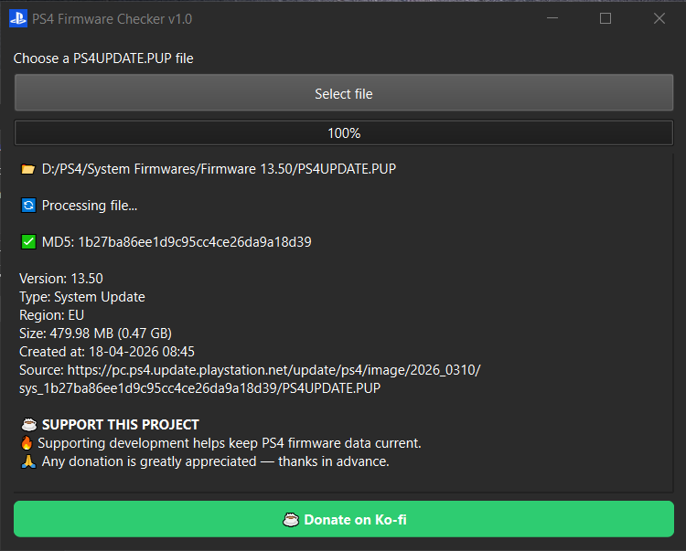

# PS4 Firmware Checker v1.1

## 📸 Preview

## 📌 Overview

PS4 Firmware Checker is a lightweight desktop application designed to quickly identify and analyze PS4UPDATE.PUP firmware files.

By selecting a firmware file, the tool retrieve detailed information about that firmware.

This includes version, file type, region, size, release date, and download source.

It also allows checking the latest available PS4 firmware version directly from Sony servers.

---

## 🚀 Key Features

- Fast analysis of PS4UPDATE.PUP files
- Automatic MD5 hash calculation
- Checks latest PS4 firmware available on Sony servers
- Displays detailed firmware information:
  - Firmware version
  - File type (System / Recovery)
  - Region
  - File size
  - Release date
  - Official download URL
- Simple and lightweight interface
- No installation required (portable executable)

---

## 🖥 How to Use

1. Open the application
2. Click **"Select file"**
3. Choose a PS4UPDATE.PUP file
4. Wait for analysis to complete
5. View firmware information instantly

---

## 📝 Changelog

v1.1

- Added the ability to check the latest firmware available online

v1.0

- Initial release
- Supports analysis of local PS4UPDATE.PUP files

---

## ☕ Support & Donations

This tool is actively maintained and improved in my free time.

Maintaining firmware databases, ensuring compatibility with new PS4 system updates requires continuous work and hosting resources.

If you find this tool useful, consider supporting its development:

👉 https://ko-fi.com/jjferreirapt

Your support helps:

- Keep firmware data accurate and up to date
- Improve performance and stability
- Add future features and enhancements

Even a small contribution makes a big difference and helps keep this project alive ❤️

---

## ⚠️ Disclaimer

This application is provided for informational and educational purposes only.  
It does not modify, patch, or interact with system firmware in any way.
